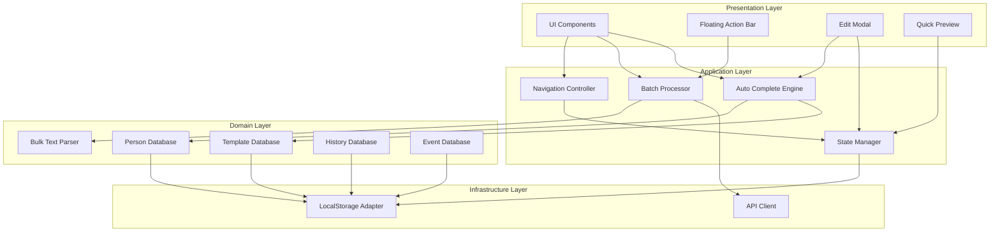

# Design Document: Photo Posting Speedup

## Overview

本設計は、イベント写真のSNS投稿作業を大幅に高速化するための機能拡張を定義する。主要な改善領域は以下の4つ：

1. **高精度テキスト解析** - 任意形式のテキストから投稿情報を自動抽出
2. **データ再利用** - 人物・ブース・イベント情報のローカル保存と自動補完
3. **バッチ処理** - 複数投稿の一括操作（コメント生成、送信、編集）
4. **UX改善** - インライン編集、キーボードショートカット、自動保存

## Architecture



## Components and Interfaces

### 1. Bulk Text Parser (BTP)

テキストから投稿情報を抽出するパーサー。

```typescript
interface ParsedEntry {
    boothName: string;
    boothAccount: string;
    personName: string;
    personAccount: string;
    role: string;
    confidence: number; // 0-100
    rawText: string;
}

interface ParseResult {
    entries: ParsedEntry[];
    format: 'numbered' | 'circled' | 'separated' | 'bullet' | 'csv' | 'unknown';
    warnings: string[];
}

interface BulkTextParser {
    parse(text: string): ParseResult;
    detectFormat(text: string): string;
    extractFields(block: string): ParsedEntry;
    validateAccount(account: string): boolean;
}
```

**Format Detection Priority:**
1. ①②③④⑤⑥⑦⑧⑨⑩ (circled numbers)
2. 1. 2. 3. or (1) (2) (3) (numbered)
3. --- or === (separated)
4. 2+ newlines (paragraph)
5. ・- * (bullet)
6. Tab/comma (csv)

**Field Extraction Patterns:**
```javascript
const FIELD_PATTERNS = {
    personName: [
        /(?:名前|Name|氏名)[：:]\s*(.+)/i,
        /(.+?)さん(?:\s|$)/,
        /^([^\s@#]+)(?=\s*@)/m
    ],
    personAccount: [
        /@([a-zA-Z0-9_]+)/,
        /(?:Twitter|X|アカウント)[：:]\s*@?([a-zA-Z0-9_]+)/i
    ],
    boothName: [
        /(?:ブース|Booth|企業|チーム|Team)[：:]\s*(.+)/i,
        /(?:◼︎|■)\s*(?:ブース|チーム)\s*\n(.+)/
    ],
    role: [
        /(?:役割|Role)[：:]\s*(.+)/i,
        /(モデル|RQ|レースクイーン|コンパニオン|コスプレイヤー|アンバサダー)/
    ]
};
```

### 2. Person Database (PDB)

人物情報を管理するローカルデータベース。

```typescript
interface PersonRecord {
    id: string;
    name: string;
    account: string;
    role: string;
    lastUsed: number; // timestamp
    useCount: number;
    events: string[]; // event IDs where this person appeared
}

interface PersonDatabase {
    search(query: string, limit?: number): PersonRecord[];
    add(person: Omit<PersonRecord, 'id' | 'lastUsed' | 'useCount'>): PersonRecord;
    update(id: string, updates: Partial<PersonRecord>): void;
    delete(id: string): void;
    getRecent(limit: number): PersonRecord[];
    getAll(): PersonRecord[];
}
```

**Storage Key:** `autopost_persons`
**Max Records:** 500

### 3. Template Database (TDB)

ブース・フィールドテンプレートを管理。

```typescript
interface BoothTemplate {
    id: string;
    name: string;
    boothName: string;
    boothAccount: string;
    category: string;
    useCount: number;
    lastUsed: number;
}

interface FieldTemplate {
    id: string;
    name: string;
    category: string; // 'TGS', 'レース', '展示会'
    fields: {
        boothName?: string;
        boothAccount?: string;
        role?: string;
        personNamePattern?: string; // e.g., "{name} さん"
    };
}

interface TemplateDatabase {
    getBoothTemplates(): BoothTemplate[];
    saveBoothTemplate(template: Omit<BoothTemplate, 'id'>): BoothTemplate;
    deleteBoothTemplate(id: string): void;
    
    getFieldTemplates(category?: string): FieldTemplate[];
    saveFieldTemplate(template: Omit<FieldTemplate, 'id'>): FieldTemplate;
    deleteFieldTemplate(id: string): void;
}
```

### 4. State Manager (SM)

アプリケーション状態とアンドゥ履歴を管理。

```typescript
interface AppState {
    currentStep: 1 | 2;
    eventInfo: EventInfo;
    postQueue: PostItem[];
    selectedIndices: number[];
    editingIndex: number | null;
}

interface UndoAction {
    type: string;
    timestamp: number;
    previousState: Partial<AppState>;
}

interface StateManager {
    getState(): AppState;
    setState(updates: Partial<AppState>): void;
    
    // Undo/Redo
    pushUndo(action: UndoAction): void;
    undo(): boolean;
    redo(): boolean;
    canUndo(): boolean;
    canRedo(): boolean;
    
    // Persistence
    save(): void;
    restore(): AppState | null;
    
    // Subscriptions
    subscribe(listener: (state: AppState) => void): () => void;
}
```

**Auto-save Interval:** 5000ms
**Undo History Limit:** 10 actions

### 5. Auto Complete Engine (ACE)

入力補完を提供。

```typescript
interface AutoCompleteEngine {
    getSuggestions(
        field: 'personName' | 'boothName' | 'account',
        query: string,
        limit?: number
    ): Suggestion[];
    
    onSelect(suggestion: Suggestion): FieldValues;
}

interface Suggestion {
    value: string;
    label: string;
    secondary?: string; // e.g., account for person
    source: 'person' | 'booth' | 'history';
    confidence: number;
}

interface FieldValues {
    personName?: string;
    personAccount?: string;
    role?: string;
    boothName?: string;
    boothAccount?: string;
}
```

### 6. Batch Processor (BP)

一括操作を実行。

```typescript
interface BatchProgress {
    total: number;
    completed: number;
    failed: number;
    current: number;
}

interface BatchResult {
    success: number;
    failed: number;
    errors: { index: number; error: string }[];
}

interface BatchProcessor {
    generateComments(
        indices: number[],
        onProgress: (progress: BatchProgress) => void
    ): Promise<BatchResult>;
    
    sendPosts(
        indices: number[],
        onProgress: (progress: BatchProgress) => void
    ): Promise<BatchResult>;
    
    applyToAll(
        field: 'booth' | 'role',
        value: any,
        indices?: number[]
    ): void;
    
    cancel(): void;
}
```

### 7. Navigation Controller (NC)

ステップ間のナビゲーションを管理。

```typescript
interface NavigationController {
    getCurrentStep(): 1 | 2;
    goToStep(step: 1 | 2, options?: { preserveQueue?: boolean }): void;
    canNavigate(to: 1 | 2): boolean;
    hasUnsavedChanges(): boolean;
}
```

## Data Models

### PostItem (Extended)

```typescript
interface PostItem {
    id: string;
    imageFile: File | null;
    imageBase64: string | null;
    boothName: string;
    boothAccount: string;
    personRole: string;
    personName: string;
    personAccount: string;
    aiComment: string;
    status: 'draft' | 'ready' | 'sending' | 'sent' | 'failed';
    createdAt: number;
    updatedAt: number;
    eventInfo?: EventInfo; // For batch events
}
```

### EventInfo (Extended)

```typescript
interface EventInfo {
    id: string;
    eventEn: string;
    eventJp: string;
    date: string;
    venue: string;
    category: string;
    hashtags: string;
    lastUsed: number;
}
```

### History Record

```typescript
interface HistoryRecord {
    id: string;
    eventId: string;
    eventName: string;
    postData: Omit<PostItem, 'imageFile'>;
    sentAt: number;
}
```

## Correctness Properties

*A property is a characteristic or behavior that should hold true across all valid executions of a system—essentially, a formal statement about what the system should do. Properties serve as the bridge between human-readable specifications and machine-verifiable correctness guarantees.*

### Property 1: Text Parsing Round-Trip Consistency

*For any* valid structured text input containing person names and accounts, parsing the text and then reconstructing it from parsed entries SHALL produce entries that contain all original @accounts.

**Validates: Requirements 1.1, 1.2, 1.3, 1.8**

### Property 2: Person Database Persistence

*For any* PersonRecord saved to Person_Database, retrieving it after a simulated page reload SHALL return an equivalent record with matching name, account, and role.

**Validates: Requirements 4.3, 4.4**

### Property 3: Autocomplete Recency Ordering

*For any* Person_Database with more than 10 entries, the first 10 results from a search query SHALL be ordered by lastUsed timestamp in descending order.

**Validates: Requirements 4.5**

### Property 4: Navigation State Preservation

*For any* Post_Queue state, navigating from Step 2 to Step 1 and back to Step 2 SHALL preserve all queue items with identical data.

**Validates: Requirements 2.2, 2.4**

### Property 5: Batch Processing Continuation

*For any* batch operation (comment generation or sending) where some items fail, the operation SHALL complete for all non-failing items and the success count plus failure count SHALL equal the total count.

**Validates: Requirements 6.1, 6.4, 12.1, 12.4**

### Property 6: Undo/Redo Consistency

*For any* sequence of state changes followed by undo operations, the state after N undos SHALL match the state before the last N changes.

**Validates: Requirements 22.3, 22.4**

### Property 7: Queue Reorder Integrity

*For any* drag-and-drop reorder operation on Post_Queue, the queue after reordering SHALL contain exactly the same items (by id) as before, with only their positions changed.

**Validates: Requirements 8.2, 8.3**

### Property 8: Bulk Apply Completeness

*For any* "Apply to All" operation with a specified field value, all targeted posts in the queue SHALL have that field set to the specified value after the operation.

**Validates: Requirements 16.2, 21.4**

### Property 9: Event Auto-Restore

*For any* EventInfo saved to localStorage, loading the application SHALL restore the event info and the restored data SHALL be equivalent to the saved data.

**Validates: Requirements 11.1, 11.2**

### Property 10: Template CRUD Consistency

*For any* BoothTemplate or FieldTemplate, saving it and then retrieving all templates SHALL include the saved template with matching fields.

**Validates: Requirements 5.1, 5.5, 23.1, 23.2**

### Property 11: Status Badge Accuracy

*For any* PostItem in the queue, the displayed status badge color SHALL match the item's status field according to the mapping: draft→gray, ready→blue, sent→green, failed→red.

**Validates: Requirements 14.1**

### Property 12: History Storage Limit

*For any* sequence of successful post sends, the History_Database SHALL contain at most 100 records, with the oldest records being removed when the limit is exceeded.

**Validates: Requirements 10.2**

## Error Handling

### Parse Errors
- Invalid format: Show warning, attempt line-by-line parsing
- Missing fields: Mark as low-confidence, highlight in preview
- Invalid @account format: Show validation error, allow manual correction

### Storage Errors
- localStorage full: Show warning, offer to clear old data
- Corrupted data: Reset to defaults, show recovery message

### Network Errors
- API timeout: Retry up to 3 times with exponential backoff
- Webhook failure: Mark post as failed, enable retry button

### State Errors
- Invalid state transition: Log error, reset to safe state
- Undo stack overflow: Remove oldest entries

## Testing Strategy

### Unit Tests
- BulkTextParser: Test each format detection and field extraction
- PersonDatabase: Test CRUD operations and search
- StateManager: Test undo/redo logic
- AutoCompleteEngine: Test suggestion ranking

### Property-Based Tests
- Use fast-check library for JavaScript
- Minimum 100 iterations per property
- Focus on data integrity and state consistency

### Integration Tests
- Full workflow: paste text → parse → edit → send
- Navigation: step transitions with state preservation
- Batch operations: concurrent processing

### E2E Tests
- Mobile responsiveness
- Keyboard shortcuts
- Drag-and-drop reordering
